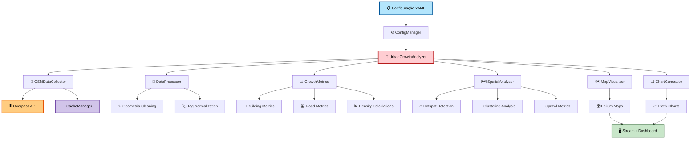
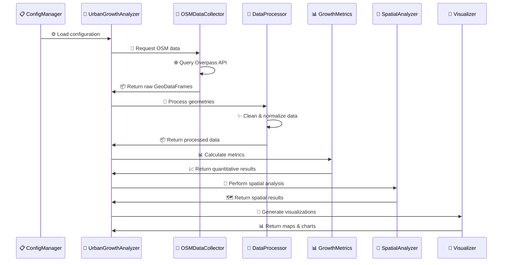
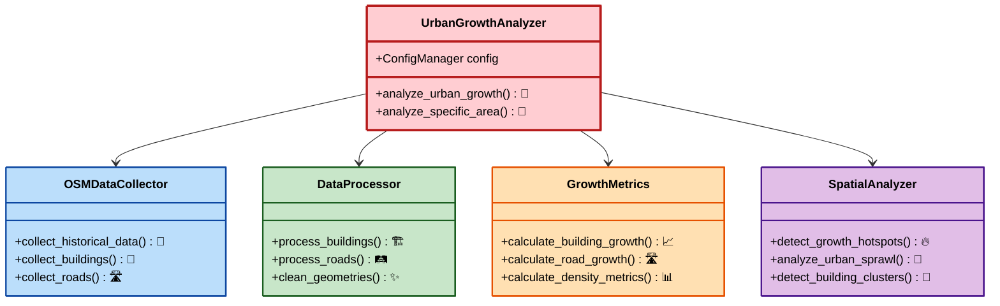

# 🏙️ OpenStreetMap Urban Growth Analysis

<div align="center">


**Sistema de análise de crescimento urbano baseado em dados OpenStreetMap com interface web interativa**

[🚀 Instalação](#-instalação) • [📊 Funcionalidades](#-funcionalidades-implementadas) • [🏗️ Arquitetura](#️-arquitetura-do-sistema) • [📖 API](#-api-principal)

</div>

---

## 🎯 Visão Geral

Este projeto implementa um **pipeline de análise geoespacial** para processamento de dados OpenStreetMap (OSM) e cálculo de métricas urbanas. O sistema coleta dados através da API Overpass, processa geometrias espaciais e gera visualizações interativas através de um dashboard Streamlit.

## 🏗️ Arquitetura do Sistema



## 📁 Estrutura do Projeto

```
🏙️ osmd/
├── 📦 src/osmd/
│   ├── 📡 data/              # Módulo de coleta e processamento
│   │   ├── collector.py      # Interface Overpass API
│   │   ├── processor.py      # Limpeza de dados geoespaciais
│   │   └── cache.py          # Sistema de cache
│   ├── 🔬 analysis/          # Módulo de análise
│   │   ├── analyzer.py       # Orquestrador principal
│   │   ├── metrics.py        # Cálculo de métricas urbanas
│   │   └── spatial.py        # Análise espacial
│   ├── 🎨 visualization/     # Módulo de visualização
│   │   ├── dashboard.py      # Interface Streamlit
│   │   ├── maps.py           # Mapas interativos
│   │   └── charts.py         # Gráficos analíticos
│   └── ⚙️ utils/             # Utilitários
│       ├── config.py         # Gerenciamento de configuração
│       ├── logger.py         # Sistema de logging
│       └── helpers.py        # Funções auxiliares
├── 📋 config.yaml           # Configuração principal
├── 📦 requirements.txt      # Dependências Python
└── 📓 notebooks/            # Jupyter notebooks
```

## 🔄 Fluxo de Processamento


## 🚀 Funcionalidades Implementadas

### 📡 **Coleta de Dados**
- 🌐 Interface com Overpass API do OpenStreetMap
- 🔄 Queries temporais para dados históricos
- 🚀 Divisão automática de áreas grandes
- 💾 Sistema de cache inteligente
- ⏱️ Rate limiting automático
- 🛡️ Tratamento de erros de rede
- 🎯 Otimização de queries por complexidade

### 🔧 **Processamento de Dados**
- ✅ Validação e limpeza de geometrias
- 🏷️ Normalização de tags OSM
- 🏢 Classificação de tipos de edificação
- 🎯 Filtragem por área e qualidade
- 🗺️ Projeção UTM automática para cálculos precisos

### 📊 **Análise Quantitativa**
- ⏰ Métricas de crescimento temporal
- 📈 Cálculos de densidade urbana com precisão geoespacial
- 🏗️ Análise de compacidade
- 📋 Taxas de crescimento por período
- 📐 Cálculos de área e distância em metros

### 🎯 **Análise Espacial**
- 🔥 Detecção de hotspots de crescimento
- 🎪 Clustering DBSCAN de edificações
- 📐 Análise de sprawl urbano
- 🔗 Métricas de conectividade
- 📏 Análise de fragmentação urbana

### 🎨 **Visualização**
- 🗺️ Mapas interativos com Folium
- 📊 Gráficos analíticos com Plotly
- 🖥️ Dashboard web com Streamlit
- 📤 Exportação de dados (JSON, CSV, GeoJSON)

## 🔄 Pipeline de Dados



## 🛠️ Instalação

### 📋 Pré-requisitos
- 🐍 Python 3.8+
- 📦 pip
- 🗺️ Dependências geoespaciais (GDAL, GEOS, PROJ)

### ⚙️ Setup
```bash
# 📥 Clonar repositório
git clone <repository-url>
cd osmd

# 🏠 Criar ambiente virtual
python3 -m venv venv
source venv/bin/activate  # 🐧 Linux/Mac
# venv\Scripts\activate   # 🪟 Windows

# 📦 Instalar dependências
pip install -r requirements.txt
```

### 🚀 Execução
```bash
# 🖥️ Dashboard web
streamlit run src/osmd/visualization/dashboard.py

# 🔬 Análise programática
python example_analysis.py

# 📓 Jupyter notebook
jupyter notebook notebooks/01_Getting_Started.ipynb
```

## ⚙️ Configuração

O arquivo `config.yaml` define parâmetros do sistema:

```yaml
# 🌐 Configuração da API Overpass
osm:
  overpass_url: "https://overpass-api.de/api/interpreter"
  timeout: 300
  cache_enabled: true

# 🗺️ Área padrão de análise
analysis:
  default_bbox:
    south: -23.6821
    west: -46.9249
    north: -23.4323
    east: -46.3654
  
  comparison_years: [2010, 2015, 2020, 2024]
  
  features:
    buildings: ["building"]
    roads: ["highway"]
    landuse: ["landuse", "amenity"]
```

## 📊 Métricas Calculadas

<div align="center">

| 📈 **Métricas de Crescimento** | 📊 **Métricas de Densidade** | 🎯 **Métricas Espaciais** |
|:---:|:---:|:---:|
| 📋 Contagem de features por ano | 🏢 Edifícios por km² | 🔥 Detecção de hotspots (percentil 80) |
| 📐 Área total construída | 🛣️ Densidade viária (km/km²) | 🎪 Clustering DBSCAN (eps=100m) |
| 📈 Taxa de crescimento percentual | 🏗️ Ratio de cobertura predial | 📍 Distância média do centro urbano |
| ⏰ Crescimento anual médio | 📏 Área média de edificações | 🎯 Índice de compacidade (área/perímetro²) |

</div>

## 💻 API Principal

### 🔬 UrbanGrowthAnalyzer
```python
from osmd import UrbanGrowthAnalyzer, BoundingBox

# 🏗️ Inicializar analisador
analyzer = UrbanGrowthAnalyzer()
bbox = BoundingBox(south=-23.55, west=-46.65, north=-23.54, east=-46.64)

# 🚀 Executar análise
results = analyzer.analyze_urban_growth(
    bbox=bbox,
    years=[2015, 2020, 2024],
    features=['building', 'highway']
)
```

### 📦 Estrutura de Resultados
```python
{
    '📋 metadata': {
        'bbox': tuple,
        'years': list,
        'processing_time_seconds': float
    },
    '📊 quantitative_analysis': {
        'building_metrics': dict,
        'road_metrics': dict,
        'density_by_year': dict
    },
    '🎯 spatial_analysis': {
        'growth_hotspots': dict,
        'urban_sprawl': dict,
        'connectivity': dict
    },
    '📦 processed_data': {
        'buildings': dict,  # 📅 por ano
        'roads': dict,      # 📅 por ano
        'landuse': dict     # 📅 por ano
    }
}
```

## ⚠️ Limitações Conhecidas

### 📅 **Dados Históricos**
- 🔄 Queries temporais com fallback para simulação quando necessário
- 📊 Overpass API histórica limitada para períodos muito antigos
- 🗂️ Para análises de décadas, recomenda-se OSM History Planet files

### ⚡ **Performance**
- 🚀 Divisão automática de áreas grandes para evitar timeouts
- 💾 Sistema de cache otimizado para reduzir requests
- ⏱️ Rate limiting inteligente da Overpass API
- 🎯 Queries otimizadas automaticamente por complexidade

## 📦 Dependências Principais

<div align="center">

| 📚 **Biblioteca** | 🎯 **Função** | 📊 **Versão** |
|:---|:---|:---:|
| 🗺️ geopandas | Manipulação de dados geoespaciais | ≥1.0.0 |
| 🖥️ streamlit | Interface web | ≥1.28.0 |
| 🌍 folium | Mapas interativos | ≥0.15.0 |
| 📊 plotly | Gráficos interativos | ≥5.17.0 |
| 🌐 requests | HTTP requests | ≥2.31.0 |
| 📐 shapely | Operações geométricas | ≥2.0.0 |
| 📋 pandas | Manipulação de dados | ≥2.0.0 |
| 🗺️ pyproj | Projeções cartográficas | ≥3.4.0 |
| 🤖 scikit-learn | Algoritmos de clustering | ≥1.3.0 |

</div>

## 🛠️ Desenvolvimento

### 🧪 **Testes**
```bash
python -m pytest tests/
```

### 🎨 **Linting**
```bash
black src/ tests/
flake8 src/ tests/
```

### 🏗️ **Estrutura de Classes**



---

<div align="center">

## 📄 Licença

**MIT License** - Ver arquivo LICENSE para detalhes

## 🛠️ Tecnologias


---

**🏙️ Desenvolvido para análise urbana baseada em dados abertos**

</div>